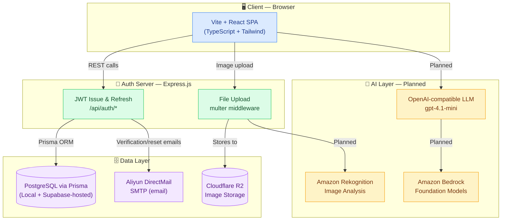

<div align="center">

# 🔗 CircuLink

**A second-hand marketplace & donation platform for Duke Kunshan University**

[](https://reactjs.org/)
[](https://www.typescriptlang.org/)
[](https://vitejs.dev/)
[](https://tailwindcss.com/)
[](https://expressjs.com/)
[](https://supabase.com/)
[](https://www.prisma.io/)
[](LICENSE)

*Connecting the DKU community — buy, sell, and donate with ease.*

</div>

---

## 📖 About

CircuLink is a web platform designed exclusively for the **Duke Kunshan University** community. It combines a **second-hand marketplace** and a **donation board** in one place, making it easy for students, faculty, and staff to give items a second life — reducing waste and building community.

- **Marketplace** — List and browse pre-owned items within the DKU campus
- **Donation Hub** — Post or claim items for free, no exchange needed
- **Community-first** — Restricted to authenticated DKU community members

---

## 🎬 Demo

> 📹 *Demo video coming soon — check back after the next release!*

<!-- Once you have a video, replace the above line with one of:
     YouTube: [](https://www.youtube.com/watch?v=YOUR_VIDEO_ID)
     GitHub-hosted mp4: paste the CDN link from dragging a video into any GitHub Issue -->

---

## 🏗️ Software Architecture

CircuLink is a **single-page application (SPA)** with a lightweight Express auth server and Supabase as the cloud database backend.



### Component Overview

| Layer | Technology | Responsibility |
|-------|-----------|----------------|
| **Frontend SPA** | Vite + React 18 + TypeScript | UI, routing, state management |
| **Styling** | Tailwind CSS + lucide-react | Component design system |
| **Auth Server** | Express.js + JWT + bcryptjs | Token issue/refresh, verification/reset emails, uploads |
| **ORM** | Prisma | Type-safe DB access |
| **Database** | PostgreSQL (local or Supabase-hosted) | Primary data store |
| **Image Storage** | Cloudflare R2 (falls back to local disk in dev) | Listing photos |
| **Email** | Aliyun DirectMail SMTP (falls back to console logging in dev) | Verification & password reset |
| **Testing** | Vitest integration suite (`server/tests`) | Auth, items, orders, messages, security |
| **AI (planned)** | OpenAI-compatible API + Amazon Bedrock/Rekognition | Smart listings, recommendations, moderation |

---

## ✨ Features

- 🛒 **Marketplace** — Post, browse, search, and filter second-hand items by category, price, and condition
- 🎁 **Donation Board** — Give or receive items for free within the DKU community, with admin review of donation submissions
- 🔐 **JWT Authentication** — Secure login with access/refresh token rotation via the Express auth server
- ✉️ **Email Verification & Password Reset** — Aliyun DirectMail SMTP integration, with automatic log-only fallback in local dev
- 📸 **Image Uploads** — Cloudflare R2 object storage in production, with automatic fallback to local disk (`uploads/`) in dev
- 🛡️ **Admin Console** — Role-based admin pages for managing users (`ADMIN`/`USER` roles), reviewing donations, and moderating listings
- 💬 **Messaging & Orders** — In-app buyer/seller messaging and order tracking
- 🏷️ **Category System** — Items organized by Development Boards, Components, Tools, Kits, Displays, Power & Batteries
- 📱 **Responsive Design** — Tailwind-first layout, works on desktop and mobile

---

## 🤖 AI Features (In Progress — with DKU AI Club × Amazon)

CircuLink is integrating AI capabilities in collaboration with the **DKU AI Club**, supported by **Amazon Web Services**. The LLM endpoint is already configured in `.env.example`.

| Feature | Status | AWS Service |
|---------|--------|-------------|
| **AI Listing Generator** — auto-fill title, description & category from item name | 🔜 Planned | Amazon Bedrock |
| **Price Estimator** — suggest fair secondhand price by condition | 🔜 Planned | Amazon Bedrock |
| **Image Auto-Categorization** — detect item type from photo | 🔜 Planned | Amazon Rekognition |
| **Content Moderation** — flag inappropriate images & text | 🔜 Planned | Amazon Rekognition |
| **Natural Language Search** — "cheap Arduino kit under 100 yuan" | 🔜 Planned | Amazon Bedrock |
| **Donation Matching** — match donors with users who need similar items | 🔜 Planned | Amazon Bedrock |

---

## 🚀 Getting Started

### Prerequisites

- [Node.js](https://nodejs.org/) v18+
- [npm](https://www.npmjs.com/) or [pnpm](https://pnpm.io/)
  
### Check your versions with:
```bash
node -v
npm -v
psql --version
```

### Install PostgreSQL (Mac)
```bash
brew install postgresql@18
brew services start postgresql@18
```


### Installation

```bash
# 1. Clone the repository
git clone https://github.com/CircuLink-DKU/CircuLink---WebDesign.git
cd CircuLink---WebDesign

# 2. Install dependencies (repo is npm-based — package-lock.json)
npm install

# 3. Set up environment variables
cp .env.example .env
# Edit .env — set DATABASE_URL and the JWT secrets.
# Set your database username (usually your Mac username):
#   DATABASE_URL=postgresql://YOUR_USERNAME@localhost:5432/circulink

#Example (env):
DATABASE_URL=postgresql://yt@localhost:5432/circulink


# 4. Set up the local database
createdb circulink
npx prisma generate
npx prisma db push
```

### Running Locally

```bash
# Terminal 1 — Run this from the root directory (Backend)
npm run dev:server
# you will see: Server running on port: 4000

# Terminal 2 — Run this from the root directory (Fronted)
npm run dev
# you will see: Local: http://localhost:5173/
```

Then open [http://localhost:5173](http://localhost:5173) in your browser.

> The Express auth server runs on port `4000` by default (`VITE_API_URL=http://localhost:4000/api`).
> Email (Aliyun DirectMail) and image storage (Cloudflare R2) are optional in dev — if left unconfigured in `.env`, emails are logged to the console instead of sent, and uploads fall back to local disk (`uploads/`).

### Running Tests

```bash
npm run typecheck   # TypeScript checks (client + server)
npm run lint        # ESLint
npm test            # Build server + run the Vitest integration suite (server/tests)
```

---

## 📁 Project Structure

```
CircuLink---WebDesign/
├── src/                        # Vite + React + TypeScript SPA
│   ├── components/             # Reusable UI components (Header, etc.)
│   ├── pages/                  # Route-level page components (Buy, Sell, Donation,
│   │                           #   Admin*, Orders, Messages, Profile, Auth flows…)
│   ├── hooks/                  # Custom React hooks
│   ├── context/                # React context providers (auth, cart…)
│   ├── lib/                    # Supabase client & utilities
│   └── types/                  # TypeScript type definitions
├── server/                     # Express.js auth/API server
│   ├── src/                    # Routes, middleware, email & storage adapters
│   └── tests/                  # Vitest integration test suite (auth, items,
│                               #   orders, messages, security)
├── prisma/                     # Prisma ORM
│   ├── schema.prisma           # Database schema (User, Item, Category…)
│   └── migrations/             # Prisma migration history
├── supabase/
│   └── migrations/             # Supabase SQL migrations
├── deploy/                     # systemd service unit & nginx config for prod
├── docs/                       # Deployment runbook, API docs, admin guides
├── scripts/                    # Dev helper utilities (smoke tests, seeding)
├── public/                     # Static assets served by Vite
├── .env.example                # Environment variable template
├── vite.config.ts              # Vite configuration
├── tailwind.config.js          # Tailwind CSS configuration
└── tsconfig.json               # TypeScript configuration
```

---

## 🗄️ Data Model (Prisma)

Key entities in `prisma/schema.prisma`:

| Model | Key Fields |
|-------|-----------|
| **User** | `email`, `passwordHash`, `name`, `role` (`ADMIN` / `USER`), email verification & reset-token fields |
| **Item** | `title`, `description`, `price`, `condition`, `status`, `images[]`, `sellerId`, `categoryId` |
| **Category** | `name`, `slug` (e.g. `dev-boards`, `components`) |
| **Order** | Buyer/seller linkage, order status |
| **Message** | In-app buyer/seller messaging |

Item `condition` values: `LIKE_NEW`, `GOOD`
Item `status` values: `ACTIVE`, `SOLD`, `DONATED`

> 🛡️ Only accounts with `role = ADMIN` can access `/admin/*` routes (user role management, donation review, listing moderation).

---

## 🤝 Contributing

We welcome contributions from the DKU community! Please read our [Contributing Guide](CONTRIBUTING.md) before submitting a pull request.

```bash
git checkout -b feature/your-feature
git commit -m "feat: describe your change"
git push origin feature/your-feature
# then open a Pull Request
```

---

## 👥 Team

Built with ❤️ by students at **Duke Kunshan University**, in collaboration with the **DKU AI Club** and **Amazon Web Services**.

| Role | Contact |
|------|---------|
| Project Lead | [@CircuLink-DKU](https://github.com/CircuLink-DKU) |
| Frontend | — |
| Backend | — |
| AI / AWS | DKU AI Club |

> Want to add your name? Open a PR and update this table!

---

## 📄 License

This project is licensed under the MIT License — see the [LICENSE](LICENSE) file for details.

---

<div align="center">
  Made at Duke Kunshan University 🎓
</div>
