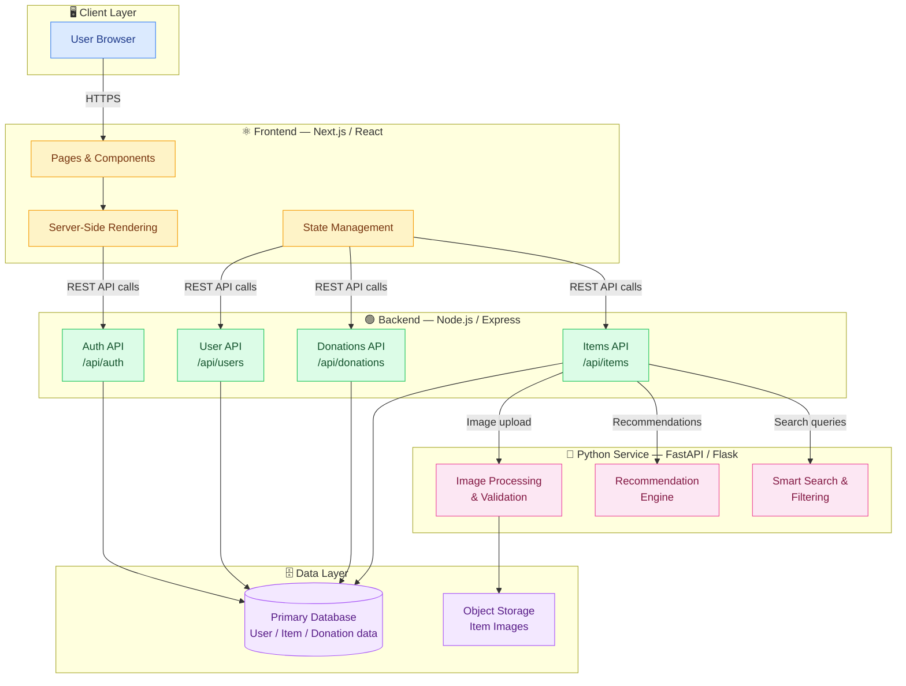

<div align="center">

# 🔗 CircuLink

**A second-hand marketplace & donation platform for Duke Kunshan University**

[](https://reactjs.org/)
[](https://nextjs.org/)
[](https://nodejs.org/)
[](https://www.python.org/)
[](LICENSE)

*Connecting the DKU community — buy, sell, and donate with ease.*

</div>

---

## 📖 About

CircuLink is a web platform designed exclusively for the Duke Kunshan University community. It combines a **second-hand marketplace** and a **donation board** in one place, making it easy for students, faculty, and staff to give items a second life — reducing waste and building community.

- **Marketplace** — List and browse pre-owned items within the DKU campus
- **Donation Hub** — Post or claim items for free, no exchange needed
- **Community-first** — DKU NetID authentication keeps the platform safe and trusted

---

## 🎬 Demo

> 📹 *Demo video coming soon — check back after the next release!*

<!-- Once you have a video, replace the above line with:
[](https://www.youtube.com/watch?v=YOUR_VIDEO_ID)
Or for a local video file:
https://github.com/CircuLink-DKU/CircuLink---WebDesign/assets/YOUR_VIDEO_FILE.mp4
-->

---

## 🏗️ Software Architecture

CircuLink follows a **three-tier architecture** separating the user interface, business logic, and auxiliary services.



### Component Overview

| Layer | Technology | Responsibility |
|-------|-----------|----------------|
| **Frontend** | Next.js + React | UI rendering, routing, SSR |
| **Backend API** | Node.js + Express | Business logic, authentication, REST endpoints |
| **Python Service** | FastAPI / Flask | Search, recommendations, image processing |
| **Database** | (your DB here) | Persistent storage for users, items, donations |
| **Object Storage** | (your storage) | Item listing images |

---

## ✨ Features

- 🛒 **Marketplace** — Post, browse, search, and filter second-hand items
- 🎁 **Donation Board** — Give or receive items for free within the DKU community
- 🔐 **DKU Authentication** — Secure login restricted to DKU community members
- 🔍 **Smart Search** — Filter by category, price range, condition, and location on campus
- 📸 **Image Uploads** — Add photos to listings with automatic validation
- 💬 **In-App Messaging** — Contact sellers/donors directly through the platform
- 📱 **Responsive Design** — Works on desktop and mobile

---

## 🚀 Getting Started

### Prerequisites

- [Node.js](https://nodejs.org/) v18+
- [Python](https://www.python.org/) 3.10+
- [npm](https://www.npmjs.com/) or [yarn](https://yarnpkg.com/)

### Installation

```bash
# 1. Clone the repository
git clone https://github.com/CircuLink-DKU/CircuLink---WebDesign.git
cd CircuLink---WebDesign

# 2. Install frontend dependencies
cd frontend
npm install

# 3. Install backend dependencies
cd ../backend
npm install

# 4. Install Python service dependencies
cd ../services
pip install -r requirements.txt

# 5. Set up environment variables
cp .env.example .env
# Edit .env with your configuration
```

### Running Locally

```bash
# Start the backend (from /backend)
npm run dev

# Start the Python service (from /services)
uvicorn main:app --reload
# or: python app.py

# Start the frontend (from /frontend)
npm run dev
```

Then open [http://localhost:3000](http://localhost:3000) in your browser.

---

## 📁 Project Structure

```
CircuLink---WebDesign/
├── frontend/               # Next.js / React application
│   ├── pages/              # App routes and pages
│   ├── components/         # Reusable UI components
│   ├── styles/             # Global styles
│   └── public/             # Static assets
├── backend/                # Node.js / Express API server
│   ├── routes/             # API route handlers
│   ├── middleware/         # Auth, validation, error handling
│   ├── models/             # Database models
│   └── config/             # Configuration files
├── services/               # Python microservice
│   ├── search/             # Search & filtering logic
│   ├── recommendations/    # Recommendation engine
│   └── image/              # Image processing
├── docs/                   # Documentation & assets
│   └── architecture.md     # Architecture details
└── .github/                # GitHub templates & workflows
```

---

## 🤝 Contributing

We welcome contributions from the DKU community! Please read our [Contributing Guide](CONTRIBUTING.md) before submitting a pull request.

1. Fork the repository
2. Create a feature branch (`git checkout -b feature/your-feature`)
3. Commit your changes (`git commit -m 'Add some feature'`)
4. Push to the branch (`git push origin feature/your-feature`)
5. Open a Pull Request

---

## 👥 Team

Built with ❤️ by students at **Duke Kunshan University**.

| Role | Contact |
|------|---------|
| Project Lead | [@CircuLink-DKU](https://github.com/CircuLink-DKU) |
| Frontend | — |
| Backend | — |
| Design | — |

> Want to add your name? Open a PR and update this table!

---

## 📄 License

This project is licensed under the MIT License — see the [LICENSE](LICENSE) file for details.

---

<div align="center">
  Made at Duke Kunshan University 🎓
</div>
